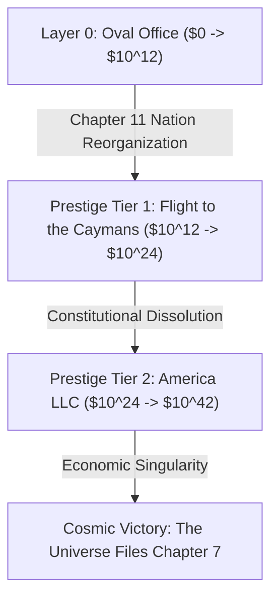

# 🦅 EXECUTIVE DEGEN: SHORT THE WORLD
*(The Art of the 3:00 AM Tariff)*
## Master Game Design Document (GDD) & Technical Specification

---

## 1. High Concept & Thematic Pillars

* **Title:** **EXECUTIVE DEGEN: SHORT THE WORLD**  
* **Subtitle:** *The Art of the 3:00 AM Tariff*  
* **Genre:** Satirical Incremental / Macroeconomic Clicker / Volatility Sandbox  
* **Target Audience:** Fans of *Universal Paperclips*, *Cookie Clicker*, *AdVenture Capitalist*, financial meme culture (r/wallstreetbets), and institutional satire.  
* **Thematic Tone:** Reality-TV kleptocracy, WallStreetBets degen nihilism, sleep-deprived 3:00 AM social media delirium, and cosmic financialized absurdity.  
* **Core Philosophy:** **The satirical punchline IS the mechanical loop.** The player does not observe corruption; they operate the economic machinery where presidential geopolitical chaos directly manufactures insider options liquidity.
* **Legal Safety & Parody Doctrine:** 100% legally bulletproof under transformative parody and caricature (*Hustler v. Falwell*, *Campbell v. Acuff-Rose*). Zero real-world names, trademarks, living politicians, or official agencies. Everything is an exaggerated, stylized composite caricature.

---

## 2. The Parody Universe & Entity Roster

### The Cast & Tools
* **The Protagonist:** *"The Dealmaker-in-Chief"* — A shadowy silhouette with an aerodynamic, glowing golden comb-over, a red power-tie that drags 6 feet across the carpet, and hands that glitch in scale between microscopic doll hands and massive mutated lobster claws based on market leverage.
* **The Social Platform:** **`YAP`** — The minimalist platform where you drop high-velocity decrees. The primary button is **[LAUNCH LETHAL YAP]**.
* **The Trading Terminal:** **`BagHolder Pro`** — A gaudy, high-contrast fintech terminal taped underneath the Resolute Desk featuring neon-green candles, blood-red plunges, and celebratory casino confetti animations when your account suffers catastrophic margin calls.
* **The Prediction Terminal:** **`PolyGrift`** — Live betting terminal where you bet personal offshore slush funds on your own upcoming unhinged executive actions before dropping them on `YAP`.
* **The Hatchet Agency:** **`D.U.M.P.`** (*Department of Unilateral Market Pruning*) / **`C.H.O.P.`** (*Chainsaw Harvesting of Outlay Programs*) — Staffed by 23-year-old venture capital interns wearing fleece vests who liquidate federal agencies with chainsaw icons.
* **The Benchmark Index:** **The S&Pain 500 (`$PAIN`)** — The national barometer of financial distress.

### The Parodied Geopolitical Targets
| Real-World Target | Parody Nation | Chief Exports / Satirical Target |
| :--- | :--- | :--- |
| **Canada** | **The Great Northern Annex** *(Snowcumbia)* | Unaffordable Housing, Passive-Aggressive Geese, Strategic Maple Slurry |
| **Mexico** | **The Nearshore Federation** | Precision Auto Harnesses, Weaponized Avocados, Nearshored Factory Slots |
| **France** | **The Strike Republic** | 35-Hour Workweeks, Luxury Fragrance Cartels, Nuclear Defiance |
| **Germany** | **Overthinker Union** *(Das Rustbelt)* | Depressed Diesel Engines, Unreadable Compliance Manuals |
| **China** | **The Red Factory** *(Temu Prime)* | Rare Earth Hexes, 99.8% Global Supply Dominance, Gadgets That Melt in 48h |
| **Taiwan** | **Silicon Archipelago** | 2-Nanometer Miracles, GPU Monopoly, Existential Tension |
| **Denmark / Greenland** | **Future State #52** | Mineral Deeds, Glacial Spite, Unilateral Purchase Offers |
| **Switzerland** | **The Secrecy Haven** | Untouchable Gold Bars, Coded Accounts, Weaponized Moral Neutrality |

### The Parodied Corporate Conglomerates
* **Apple:** **Fruit Ecosystem Inc. (`$FRUT`)** ($1,999 Titanium Rectangles, $400 proprietary charging dongles, *FruitWrist Ultra Pro Max*).
* **Tesla:** **GigaFlex Motors (`$GIGA`)** (Rusting angular wedge-trucks, stock propped 100% by CEO shitposting).
* **Boeing:** **DoorPlug Dynamics (`$DOOR`)** (Commercial jets held together by prayer and whistleblower intimidation).
* **Microsoft:** **MicroSoftness Cloud (`$MICR`)** (Mandatory un-uninstallable AI updates that blue-screen hospital networks).
* **Chipotle:** **GuacSurcharge Grill (`$GUAC`)** (3.5oz lukewarm carnitas, viral consumer scale-weighing protests).
* **Nvidia:** **MicroSilicon Foundry (`$MSIL`)** (Led by Leather-Jacket Larry, who sweats synthetic thermal grease).

---

## 3. Core Mechanics & Mathematical Specifications

### 3.1 The Primary Clicker: Two-Phase Kinesthetic Progression

#### Phase 1 Clicker: The Blue Rubber Stamp ($0 to $1M)
* **Setting:** Gate 99B, Liberty International Airport (Terminal Under Continuous Asbestos Abatement Since 1974).
* **The Interaction:** A heavy, ink-stained blue rubber stamp: **[CONFISCATED - BY ORDER OF AGENT 412]** slamming down onto tourist baggage declarations and wheels of foreign brie on a scuffed laminate TSA counter.
* **The Side-Hustle:** Confiscated goods are tossed into the desk mini-fridge and flipped on **GriftBay Underground** for seed capital.
* **The Milestone ($1M):** Sirens wail, screen fades to black, and an armored motorcade whisks the player directly to the Oval Office!
* **Early Market Unlock (first slam):** BagHolder Pro's stock console and YAP open the moment the player stamps for the first time, while still at Customs. The connected mechanics then unfold from player actions: the first YAP opens S.L.O.P. Radar; settling a PUT opened before that YAP opens PolyGrift.
  * **Rationale:** this was originally a **$10K cash threshold**, roughly 2,000 manual clicks. That buried the game's actual subject — the causal shorting loop — behind a wall of clicking, and the overwhelming majority of players never reached it. Gating the premise on tedium is not onboarding. See `.agents/workflows/UI_REDESIGN_PLAN.md`.
  * **Paper trades:** the first 3 contracts are risk-free (losses refund, wins pay). Combined with the 5-step directive tutorial, the player learns the verb without going bankrupt on a first guess.

#### Phase 2+ Clicker: The Golden Squeak & Tantrum System ($1M+)
* **Setting:** The Resolute Desk in the Oval Office.
* **The Interaction:** Clicking slams an oversized 24k Golden Sharpie onto an official Executive Order parchment with physical screen shake, ink splatter particles, and procedural squeaks ($200\text{Hz} \to 850\text{Hz}$).
* **Stamina & "The Desperation Dry Nib Squeak":**
  * Base Ink: $I_{\max} = 100 \text{ Units}$. Consumption: $1.25 \text{ Units/click}$; passive recovery is $0.5$ units/second.
  * When $I > 0$: normal yield and $+1.5\%$ Tantrum/click ($+2.25\%$ with Diet Soda Desk Drip).
  * When $I = 0$: click yield drops by 90%, but dry scratches add $+3.5\%$ Tantrum/click. Dry clicks can fill the meter to 100%.
  * Frenzy lasts 20 seconds, multiplies click yield by $10$, pauses ink consumption, and restores the tank to 100% on activation.
* **CAPS LOCK FRENZY:**
  * Triggered at $100\%$ Tantrum (lasts 20s).
  * $10\times$ Click Multiplier with no ink consumption for the duration.
  * Screen borders flash violently in neon red; news ticker scrolls unhinged headlines (*"WALL STREET PARALYZED BY EXECUTIVE COVFEFE"*, *"TARIFF ON INCOMING METEORS DECLARED"*).

---

### 3.2 The Causal Insider Shorting Loop & "The Straddle Squeeze"
```
[Select Target Ticker] ──> [Buy PUT ($)]
                                   │
                                   ▼
                       [Launch 3:00 AM Lethal YAP]
                                   │
                                   ▼
                     [Sector Crashes -20% to -80%]
                                   │
                                   ▼
                         [Settle PUT to Bank Result]
                                │
                                ▼ (8-Second Skill Window)
                  [Buy Matching CALL, then WALK-BACK CLARIFICATION]
                                   │
                                   ▼
                    [35% Recovery Pump; CALL Settles]
```

        The walk-back is an optional skill bonus. Only a CALL opened on the crashed ticker during the 8-second window qualifies. Activating WALK-BACK applies the recovery pump and settles that CALL. If the window expires, the combo CALL collateral is returned; an already settled PUT payout is unchanged.

* **Options Valuation & Volatility Spike (Vega Expansion):**
  A YAP applies a bounded, positive crash severity. Frenzy and shotgun mode increase the severity, but never beyond 92%:
  $$d = \min\left(0.92, \left(0.25 + \frac{\text{YAP tariff percentage}}{1000}\right) M_{\text{frenzy}} M_{\text{shotgun}}\right)$$
  $$S_{\text{crash}} = \max\left(1, S_0(1-d)\right)$$
  $VEX$ rises by 25 points for a selected-target YAP or 35 in shotgun mode, capped at 80, then decays toward 15 at 0.5 points/second. The implemented arcade payout uses directional price change rather than a Black-Scholes option model:
  $$M_{\text{VEX}} = 1 + \max\left(0, \frac{VEX - 15}{100}\right)$$
  $$r = \begin{cases}(S_0-S_1)/S_0 & \text{PUT} \\ (S_1-S_0)/S_0 & \text{CALL}\end{cases},\quad P = C + C\max(-1, r\Lambda M_{\text{VEX}})M_{\text{fiber}}$$
  Loss is capped at the collateral; profitable Dark Pool Fiber trades use $M_{\text{fiber}}=1.5$, otherwise $M_{\text{fiber}}=1$. Trades expire after 60 seconds unless settled early.

* **The S.L.O.P. Regulatory Suspicion Escalation ($0\text{--}100\%$):**
  1. *0–49% (Whispers on Cable News)*: Normal operations.
  2. *50–89% (Congressional Subpoenas)*: +1.5s order fill latency on BagHolder Pro; +10% slippage.
  3. *90–99% (Grand Jury Subpoena Pending)*: Flashing siren banner with an active **[SUBPOENA DODGE]** quick-time event: A paper shredder appears; player has 5 seconds to slam documents into the shredder to flush 40% suspicion!
  4. *100% (Special Counsel Raid)*: Unlocks the **"Executive Privilege Filibuster"** mini-game where clicking desk drawers bribes investigators or fires prosecutors using **Crony Favor (🤝)**.

---

### 3.3 The Procedural 3:00 AM YAP Generator (Mad-Libs Syntax)
YAPs are assembled via a 7-stage stochastic token matrix:
$$\text{YAP} = [\text{TIME\_PREFIX}] + [\text{TARGET\_ENTITY}] + [\text{BIZARRE\_GRIEVANCE}] + [\text{PUNITIVE\_DECREE}] + [\text{UNHINGED\_NON\_SEQUITUR}] + [\text{DEVICE\_OUTRO}]$$

* **Example Output (Tech):**
  > *"Terrible sources telling me the Silicon Valley ‘AI Geniuses’ are secretly cooling their chips with UNFILTERED TAP WATER! Starting 9:00 AM: all compute clusters require a 400% Patriot Tax unless powered by domestic coal. Leather-Jacket Larry needs to stop wearing that leather jacket indoors, he is sweating all over the supply chain! HIGHLY UNSTABLE! (Dictated into FruitWrist Ultra Pro Max while eating a 113-Gram Freedom Patty)"*

* **The Simulated Reply Swarm:**
  - **Hyper-Caffeinated Pundit (`@MadBagsJim`):** *"SELL THE HARVEST! THE SEED CROPS ARE GONE! Wait—he posted a thumbs-up? BUY CALLS! V-SHAPED SUPER-CYCLE! [Soundboard shatter effect]"*
  - **Techno-Oligarch (`@ElongatedMuskrat`):** *"Concerning. Looking into replacing the entire supply chain with Optimus wedge-bots running on memes."*
  - **Foreign Ambassadors begging in public quote-yaps.**

* **The "Fat-Finger Autocorrect" Mini-Event:**
  - A late-night typo swaps a target ticker (e.g., typing `$DOOR` $\to$ `$DOORZ`, or "DoorPlug" $\to$ "DorkPlug" `$DORK`).
  - High-frequency trading bots misinterpret the code, triggering a **+10,000% penny stock pump**.
  - 45-second player dilemma: Issue immediate retraction, double down on 4D chess, or secretly dump personal offshore holdings on GriftBay at the peak.

* **Diplomatic Hostage Begging DMs:**
  - Foreign leaders slide into unencrypted DMs offering absurd bribes (e.g., Sweden offers lifetime SpottyFi Slopcast Platinum and free FLÅTBÄCK assembly by special forces; a Gulf monarch offers an albino hunting falcon wearing 24k gold Bolex chronometers on both talons; Future State #52 pleads for relief from the 850% tariff on KLLIK-BLOKS).

---

### 3.4 The D.U.M.P. Liquidation Tree & Disaster Capitalism

| # | Agency Liquidated | Instant Cash ($) | Ongoing Passive Perk | Catastrophic Hazard | Disaster Capitalism Silver Lining |
|---|---|---|---|---|---|
| **1** | **N.O.C.L.O.U.D. (Weather Bureau)** | **+$250,000** | +15% Shipping Speed | **Cat-5 Hurricanes**: Shipping halts 15s. | **Emergency Umbrella Tariffs**: Click desk to levy 500% emergency duty on rain gear! |
| **2** | **F.A.T. (Food & Toxin)** | **+$1,200,000** | +30% CAPS LOCK Frenzy duration | **Mystery Sludge Recall**: Revenue reverses 10s. | Rebrand sludge as **"Patriot Protein Paste"** to double institutional profits! |
| **3** | **A.I.R. (Aviation Admin)** | **+$4,500,000** | 0ms execution on BagHolder Pro | **Runway Incursions**: 10% shipments crash. | Sell crash scrap to foreign metal dealers for immediate cash! |
| **4** | **S.M.O.G. (Environment)** | **+$15,000,000** | +25% Passive industrial revenue | **Flammable Tap Water**: Sharpie catches fire. | Sign orders with **"Scorched Earth Directives"** (+50% foreign tariff rate). |
| **5** | **S.N.A.I.L. (Postal Service)** | **+$50,000,000** | 100% margin on foreign trade parcel duties | **14% Lost Parcel Paradox**: Orders lost in mail. | Unlock **"Unclaimed Cargo Mystery Box Auctions"** under BagHolder Pro! |
| **6** | **S.L.O.P. (Securities Comm)** | **+$180,000,000** | Suspicion accumulation -75%; 5,000x leverage | **Ponzi Cascade**: Stock rug-pulls to $0.00 every 3m. | Front-run the rug-pull with automated short puts! |
| **7** | **S.H.A.K.E. (Tax Service)** | **+$650,000,000** | +50% Retained corporate profit growth | **Honesty Box Deficit**: Debt compounds +10%. | Blame the deficit on trading partners to justify 1,000% retaliatory tariffs! |
| **8** | **D.O.E.-N.U.K.E. (Atomic)** | **+$2,500,000,000** | +200% Executive Mansion crypto rig yield | **Geiger Counter Clicker**: 2.5% click chance to trigger mutant auto-tariffs. | Free radioactive glow doubles night-shift intern typing speed! |
| **9** | **C.O.U.G.H. (Contagion)** | **+$8,000,000,000** | Manual "Health Scare" button (-60% market) | **Cabinet Super-Gout**: Intern passive click rates drop 40% on Mondays. | Sell holistic "Freedom Tonics" directly from the Oval Office! |
| **10**| **THE BRRR VAULT ($BRRR)** | **+$100,000 per print** | **"PRINT $BRRR"** physical desk button; 60-second cooldown | **S.L.O.P. Heat Surge**: Suspicion rises +15 per print. | Deliberate liquidity injection with a visible raid risk. |

---

### 3.5 Inflation Heat, Civil Unrest & Offline Safety
* **Inflation Heat ($H \in [0, 100]$):** Generated by signing tariffs (+0.8%), D.U.M.P. cuts (+5%), and printing money (+3.5%). Mitigated by ordering military flyovers (-5%), announcing UFO disclosures (-12%), or sending $200 stimulus checks (-25%).
* **Tiers:** 0–35% (Docile) $\to$ 36–75% (Spicy Vibes: +25% Tantrum fill) $\to$ 76–99% (Pre-Riot Euphoria: +250% option volatility) $\to$ 100% (General Strike: 60s freeze, bypassable via 10 Crony Favor).
* **The Palm-a-Grifto Golf Protocol (Offline Safety Guarantee):**
  - Offline time **never** ruins an active game.
  - Heat, Unrest, S.L.O.P. Suspicion, and margin calls are **100% frozen** when the tab closes.
  - Passive Treasury revenue continues to accrue safely for up to 48 hours.
* **The Triple Bankruptcy Bailout Anchors (Zero Soft-Locks):**
  1. **"Palm-a-Grifto Secret Service Invoice":** If liquid cash $< \$10$ and positions closed, an emergency red phone flashes: **[BILL SECRET SERVICE FOR GOLF CARTS]**, granting $\$5,000 \times (1 + \text{Phase})$ instant liquidity.
  2. **"Bathroom Chandelier Classified Document Sale":** Gold box on desk lets you sell state secrets to offshore buyers for $\$500$ (zero cooldown if cash $< \$50$).
  3. **The Desperation Dry Nib:** Dry clicks always yield at least $\$0.10 \times \text{Tap Multiplier}$ and double Tantrum generation.

### 3.6 First-Hour Progression Contract
* On the **first slam**, BagHolder Pro's stocks/options console and YAP unlock while the player remains in Phase 1. This is an *event*, not a cash threshold.
* A 5-step classified-directive tutorial drives the loop by real game events: slam → open a paper PUT → fire a YAP → settle. The first 3 contracts are paper trades (losses refund; wins pay out and feed the Tantrum meter), and a paper contract that expires on the 0DTE timer refunds its allowance rather than silently consuming it. The final manual step auto-completes on reaching Phase 2, so the directive card can never pin permanently.
* The first successful YAP reveals S.L.O.P. Radar. Settling a PUT opened before a YAP reveals PolyGrift.
* At $1,000,000, the player enters Phase 2 and unlocks D.U.M.P. liquidations. The first liquidation unlocks Crony upgrades; the first upgrade unlocks tariff controls; the first tariff change unlocks Caymans prestige.
* Phase transitions are Phase 1 at $0-$1M, Phase 2 at $1M-$100B, Phase 3 at $100B-$10^{18}$, and Phase 4 at $10^{18}$ and beyond.
* The first market tutorial teaches: select a ticker, open a PUT, target it with YAP, settle the PUT to protect its payout, then optionally arm a matching CALL and hit WALK-BACK before the 8-second window closes.

---

## 4. The 4-Phase Evolutionary Arc (Universal Paperclips Phase Shift)

```
[Phase 1: Customs Desk] ──> [Phase 2: Oval Syndicate] ──> [Phase 3: Fortress America] ──> [Phase 4: Ontological Tariffs]
  $0 -> $1,000,000            $1M -> $100 Billion         $100B -> $10^18               $10^18 -> $10^42 (Singularity)
```

BagHolder Pro and YAP unlock on the **first slam** as a Phase 1 milestone; this does not advance the formal phase.

1. **Phase 1: The Customs Desk ("Confiscation Arbitrage")**: Shaking down tourists at Gate 99B Liberty International for unpasteurized French brie, fine cigars, and luxury cosmetics. Stashing contraband in the desk mini-fridge and flipping it on GriftBay Underground.
2. **Phase 2: The Oval Syndicate ("The BagHolder Pro Era")**: Controlling global trade policy from the Resolute Desk. Front-running the S&Pain 500 with unhinged 3:00 AM YAPs, buying 1,000x leveraged options, and cashing in billions.
3. **Phase 3: Fortress America ("The D.U.M.P. Protocol")**: 2,500% tariffs freeze world trade. 3,000 container ships anchored off Long Beach form the floating rogue nation of "New Shenzhen." Navy seals board cargo ships to auction off mystery containers. Domestic substitution: FDA reclassifies powdered drywall as "High-Calcium Freedom Flour."
4. **Phase 4: Ontological Protectionism ("Taxing the Singularity")**: Every terrestrial nation is bankrupt. The Commerce Clause expands beyond spacetime into scientific notation ($10^{18} \to 10^{42}$):
   - **Solar Photon Duty (The Sun)**: 45% border duty on solar radiation entering sovereign US airspace without filing a W-8BEN.
   - **Temporal Import Duty (The Future)**: 900% tariff on tachyon knowledge and innovations borrowed from fiscal year 2070.
   - **Entropic Border Seizure (2nd Law of Thermodynamics)**: Boltzmann’s constant declared unconstitutional; molecules fined for decaying.
   - **Gravitational Lensing (Alpha Centauri)**: Sovereign debt becomes so physically dense ($10^{40}$ kg of paper currency) that it forms an economic singularity, enveloping the universe and forcing reality to file for Chapter 7 bankruptcy.

---

## 5. Multi-Tier Prestige Architecture



### Tier 1 Prestige: "Flight to the Caymans"
* **Currency:** **Sovereign Immunity Slips (SIS)**
  $$\text{SIS} = \left\lfloor \left(\frac{\text{Lifetime Treasury Cash}}{10^{10}}\right)^{0.32} + 3 \times \left(\frac{\text{Options Profit}}{10^9}\right)^{0.38} \right\rfloor$$
* **Perk Constellation:**
  1. *Shell Company Inception:* +100% base tap; start with $\$1\text{M} \times \text{SIS}^{1.2}$ seed cash.
  2. *280-Character Macro Wreck:* 4% tap chance to trigger a "Flash Dip" (+500% options valuation for 8s).
  3. *QE as a Service (QEaaS):* Treasury negative cash buffer extended to $-\$50\text{B}$.
  4. *Insider Exemption 401(k):* Auto-trades 0DTE straddles, yielding 1.5% of peak trade every 60s.
  5. *The Pardon Assembly Line:* Department costs reduced by 65%; S.L.O.P. raids abolished.
  6. *Golden Parachute Super-PAC:* Retain 15% of all department levels across resets.

### Tier 2 Prestige: "Constitutional Dissolution / America LLC"
* **Currency:** **Executive Decrees (ED)**
* **Mechanics:** The US is re-incorporated as a Delaware C-Corp (**Ticker: $AMER**); citizens reclassified as fractional shares.
* **Full Automation:** Auto-Cabinet Governance, AI Autopen (25 taps/sec), and Auto-Straddle options execution.

---

## 6. Viral Streamer Tools & Growth Engineering

### 6.1 The "Senate Hearing / TikTok Clip Generator" (9:16 Vertical Video)
* **The Concept:** Whenever a player triggers a market flash-crash or diplomatic crisis, clicking **[LEAK TO C-SNOOZE / EXPORT SHORT]** auto-compiles a shareable 15-second vertical 1080x1920 MP4:
  - **Top Window (50%):** A red-faced geriatric senator in a beige suit slams a gavel, pointing to a giant foam board displaying the player's actual 3:00 AM Yap (with username, 3:14 AM timestamp, and typos). Automated dry boomer TTS reads the tweet aloud over Vine Boom sound effects.
  - **Bottom Window (50%):** High-speed hypnotic brainrot footage (*Metro Sprinter 99: Endless Slop*, ASMR soap-cutting, kinetic sand slicing).
  - **Auto-Clipboard:** Copies clip path and viral caption: `Bro is NOT beating the insider trading allegations 💀😭 #executivedegen #senatehearing #wallstreetbets`.

### 6.2 Streamer Mode (Twitch / Kick Integration)
* **The "YAP Meter" (Chat Tantrum):** Chat spamming `!YAP` or `COOKED` fills the Executive Blood-Pressure meter, locking streamer controls into an emergency press conference.
* **Chat Tariff Polls:** Every 15 minutes, chat votes on which country receives a 750% tariff.
* **Oligarch Pardon Auctions:** Viewers donate Bits or Superchats to purchase legal tariff waivers for foreign companies, mounting a gold plaque with their username on the streamer's desk.
* **Special Counsel Raids:** When another creator raids the channel, an emergency siren triggers a "Congressional Special Counsel Raid," forcing the streamer to frantically click desk drawers to shred files before their Cayman funds get seized.
