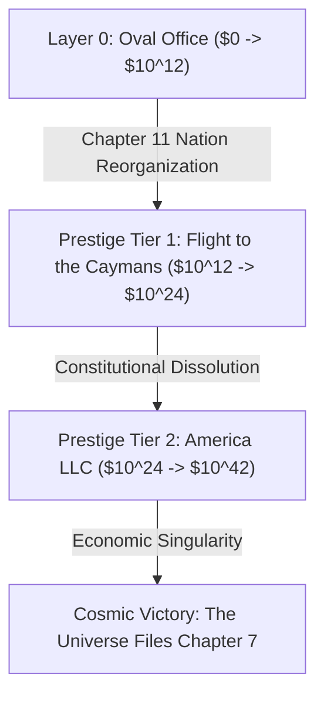

# 🦅 EXECUTIVE DEGEN: SHORT THE WORLD
*(The Art of the 3:00 AM Tariff)*
## Master Game Design Document (GDD) & Technical Specification

---

## 1. High Concept & Thematic Pillars

* **Title:** **EXECUTIVE DEGEN: SHORT THE WORLD**  
* **Subtitle:** *The Art of the 3:00 AM Tariff*  
* **Genre:** Satirical Incremental / Macroeconomic Clicker / Volatility Sandbox  
* **Target Audience:** Fans of *Universal Paperclips*, *Cookie Clicker*, *AdVenture Capitalist*, financial meme culture (r/wallstreetbets), and institutional satire.  
* **Thematic Tone:** Reality-TV kleptocracy, WallStreetBets degen nihilism, sleep-deprived 3:00 AM social media delirium, and cosmic financialized absurdity.  
* **Core Philosophy:** **The satirical punchline IS the mechanical loop.** The player does not observe corruption; they operate the economic machinery where presidential geopolitical chaos directly manufactures insider options liquidity.
* **Legal Safety & Parody Doctrine:** 100% legally bulletproof under transformative parody and satire (*Hustler v. Falwell*, *Campbell v. Acuff-Rose*). Zero real-world names, trademarks, living politicians, or official agencies. Everything is an exaggerated, stylized composite caricature.

---

## 2. The Parody Universe & Entity Roster

### The Cast & Tools
* **The Protagonist:** *"The Dealmaker-in-Chief"* — A shadowy silhouette with an aerodynamic, glowing golden comb-over, a red power-tie that drags 6 feet across the carpet, and hands that glitch in scale between microscopic doll hands and massive lobster claws.
* **The Social Platform:** **`YAP`** — The minimalist platform where you drop high-velocity decrees. The primary button is **[LAUNCH LETHAL YAP]**.
* **The Trading Terminal:** **`BagHolder Pro`** — A gaudy, high-contrast fintech terminal taped underneath the Resolute Desk featuring neon-green candles, blood-red plunges, and celebratory casino confetti animations when your account suffers catastrophic margin calls.
* **The Hatchet Agency:** **`D.U.M.P.`** (*Department of Unilateral Market Pruning*) / **`C.H.O.P.`** (*Chainsaw Harvesting of Outlay Programs*) — Staffed by 23-year-old venture capital interns wearing fleece vests who liquidate federal agencies with chainsaw icons.

### The Parodied Geopolitical Targets
| Real-World Target | Parody Nation | Chief Exports / Satirical Target |
| :--- | :--- | :--- |
| **Canada** | **The Great Northern Annex** *(Snowcumbia)* | Unaffordable Housing, Passive-Aggressive Geese, Strategic Maple Slurry |
| **Mexico** | **The Nearshore Federation** | Precision Auto Harnesses, Weaponized Avocados, Nearshored Factory Slots |
| **France** | **The Strike Republic** | 35-Hour Workweeks, Luxury Fragrance Cartels, Nuclear Defiance |
| **Germany** | **Overthinker Union** *(Das Rustbelt)* | Depressed Diesel Engines, Unreadable Compliance Manuals |
| **China** | **The Red Factory** *(Temu Prime)* | Rare Earth Hexes, 99.8% Global Supply Dominance, Gadgets That Melt in 48h |
| **Taiwan** | **Silicon Archipelago** | 2-Nanometer Miracles, GPU Monopoly, Existential Tension |
| **Denmark / Greenland** | **Future State #52** | Mineral Deeds, Glacial Spite, Unilateral Purchase Offers |
| **Switzerland** | **The Secrecy Haven** | Untouchable Gold Bars, Coded Accounts, Weaponized Moral Neutrality |

### The Parodied Corporate Conglomerates
* **Apple:** **Fruit Ecosystem Inc.** ($1,999 Titanium Rectangles, $400 proprietary charging dongles).
* **Tesla:** **GigaFlex Motors** (Rusting angular wedge-trucks, stock propped 100% by CEO shitposting).
* **Boeing:** **DoorPlug Dynamics** (Commercial jets held together by prayer and whistleblower intimidation).
* **Microsoft:** **MicroSoftness Cloud** (Mandatory un-uninstallable AI updates that blue-screen hospital networks).
* **Chipotle:** **GuacSurcharge Grill** (3.5oz lukewarm carnitas, viral consumer scale-weighing protests).

---

## 3. Core Mechanics & Mathematical Specifications

### 3.1 The Primary Clicker: The Golden Squeak & Tantrum System
* **Visual & Kinesthetics:** The primary click target is a leather-bound blotter on the Resolute Desk. Clicking slams a heavy Golden Sharpie nib into an Executive Order. Every tap triggers procedural ink squeaks, screen shake, and ink splatter particles.
* **Stamina & Ink Pool Mechanics:**
  * Base Ink Capacity: $I_{\max} = 100 \text{ Units}$.
  * Consumption per Click: $C_{\text{click}} = 1.25 \text{ Units}$.
  * Passive Regeneration: $R_{\text{ink}} = 2.50 \text{ Units/sec}$.
  * Refill Cost Formula: $\text{Cost}(n) = \$25.00 \times (1.15)^n$.
* **Tantrum Meter & "CAPS LOCK FRENZY":**
  * Tapping builds the **Tantrum Meter ($T$)** by $+1.50\%$ per click (decays at $2.5\%$/s after 1.2s idle).
  * At $100\%$, triggers **CAPS LOCK FRENZY** (12–25 seconds):
    - $7.77\times$ to $10.0\times$ Click Multiplier.
    - Zero Ink Consumption ($C_{\text{click}} = 0$).
    - Screen borders flash violently in neon red; news ticker scrolls unhinged headlines (*"WALL STREET PARALYZED BY EXECUTIVE COVFEFE"*).
    - Followed by a 3-second *Executive Slump* (bypassable via Crony Favor or launching a YAP).

---

### 3.2 The Causal Insider Shorting Loop (BagHolder Pro)
```
[Select Target Sector] ──> [Buy 10x-1000x Put Options ($)] 
                                   │
                                   ▼
                       [Launch 3:00 AM Lethal YAP]
                                   │
                                   ▼
                     [Sector Crashes -20% to -80%]
                                   │
                                   ▼
                       [Cash Out 500% - 25,000% Gain]
                                   │
                                   ▼
                    [Tweet Walk-Back "Beautiful Call with PM"]
                                   │
                                   ▼
                       [Ride Call Options Recovery Rally]
```

* **Options Valuation & Volatility Spike (Vega Expansion):**
  When a YAP drops, underlying price crashes:
  $$\Delta S(\%) = -\min\left(0.92, \; \kappa \times \left(\frac{\text{YAP\_Power}}{100}\right) \times (1 + 0.5 \times \mathbb{I}_{\text{frenzy}})\right)$$
  Volatility spikes implied volatility ($VIX$):
  $$VIX_{\text{spike}} = VIX_0 \times \left(1 + \Delta S(\%) \times 4.0\right)^{1.5}$$
  Final Payout Formula:
  $$\text{Payout} = \text{Collateral} \times \Lambda \times \left(\frac{\max(0, \; K - S_{\text{crash}})}{S_0}\right) \times \left(1 + \frac{VIX_{\text{spike}} - VIX_0}{100}\right)$$

* **The SEC Grand Jury / Ethics Committee Suspicion Meter ($0\text{--}100\%$):**
  * Huge option windfalls generate Suspicion ($\Delta S \propto \log_{10}(\text{Profit}) \times \sqrt{\Lambda}$).
  * At $50\%$, order fill latency increases and legal defense fees drain cash.
  * At $100\%$ (**DOJ Special Counsel Raid**), BagHolder Pro is frozen for 45s and $30\%$ of liquid cash is placed in escrow.
  * **Crony Favor Bribe:** Spend **Crony Favor (🤝)** to appoint compromised federal judges or fire the special prosecutor to instantly wipe suspicion.

---

### 3.3 The Procedural 3:00 AM YAP Generator (Mad-Libs Syntax)
YAPs are assembled via a 7-stage stochastic token matrix:
$$\text{YAP} = [\text{TIME\_PREFIX}] + [\text{TARGET\_ENTITY}] + [\text{BIZARRE\_GRIEVANCE}] + [\text{PUNITIVE\_DECREE}] + [\text{UNHINGED\_NON\_SEQUITUR}] + [\text{DEVICE\_OUTRO}]$$

* **Example Output (Tech):**
  > *"Terrible sources telling me the Silicon Valley ‘AI Geniuses’ are secretly cooling their chips with UNFILTERED TAP WATER! Starting 9:00 AM: all compute clusters require a 400% Patriot Tax unless powered by domestic coal. Little Jensen needs to stop wearing that leather jacket indoors, he is sweating all over the supply chain! HIGHLY UNSTABLE! (Dictated into Apple Watch while eating a Quarter Pounder)"*

* **The Simulated Reply Swarm:**
  - **Parody Jim Cramer (`@MadBagsJim`):** *"SELL THE HARVEST! THE SEED CROPS ARE GONE! Wait—he posted a thumbs-up? BUY CALLS! V-SHAPED SUPER-CYCLE! [Soundboard shatter effect]"*
  - **Parody Elon (`@ElongatedMuskrat`):** *"Concerning. Looking into replacing the entire supply chain with Optimus robots running on memes."*
  - **Foreign Ambassadors begging in public quote-tweets.**

* **The "Fat-Finger Autocorrect" Mini-Event:**
  - A late-night typo swaps a target ticker (e.g., typing `$LMT` $\to$ `$LMTD`, or "Boeing" $\to$ "Bowling" `$BOWL`).
  - High-frequency trading bots misinterpret the code, triggering a **+10,000% penny stock pump**.
  - 45-second player dilemma: Issue immediate retraction, double down on 4D chess, or secretly dump personal offshore holdings at the peak.

* **Diplomatic Hostage Begging DMs:**
  - Foreign leaders slide into unencrypted DMs offering absurd bribes (e.g., Sweden offers lifetime Spotify Platinum and free IKEA assembly by special forces; a Gulf monarch offers an albino hunting falcon wearing 24k gold Rolexes on both talons; France offers UNESCO heritage status for canned aerosol spray cheese).

---

### 3.4 The D.U.M.P. Liquidation Tree (Austerity Guillotine)

| # | Agency Liquidated | Instant Cash ($) | Ongoing Passive Perk | Catastrophic Comedic Hazard |
|---|---|---|---|---|
| **1** | **NOAA (Weather Bureau)** | **+$250,000** | +15% Shipping Speed | **Unannounced Cat-5 Hurricanes**: 5% chance/min shipping halts 15s. |
| **2** | **FDA (Food & Drug)** | **+$1,200,000** | +30% CAPS LOCK Frenzy duration | **Mystery Sludge Recall**: 8% chance revenue reverses into negative for 10s. |
| **3** | **FAA (Aviation Admin)** | **+$4,500,000** | 0ms instant execution on BagHolder Pro | **Runway Demolition Derby**: 10% of shipments crash on South Lawn. |
| **4** | **EPA (Environment)** | **+$15,000,000** | +25% Passive industrial revenue | **Flammable Tap Water**: Sharpie catches fire, draining 10% stamina on click. |
| **5** | **USPS (Postal Service)** | **+$50,000,000** | 100% margin on foreign trade parcel duties | **12% Miss-Stamps**: 12% of orders are mailed to the wrong country. |
| **6** | **SEC (Securities Comm)** | **+$180,000,000** | Suspicion accumulation -75%; 5,000x leverage | **Ponzi Inception**: Every 3 mins, a random owned stock rug-pulls to $0.00. |
| **7** | **IRS (Tax Service)** | **+$650,000,000** | +50% Retained corporate profit growth | **Honesty Box Deficit**: Random `NaN` errors; debt randomly compounds +10%. |
| **8** | **DOE Nuclear Directorate**| **+$2,500,000,000** | +200% White House crypto rig yield | **Geiger Counter Clicker**: 2.5% click chance to trigger mutant auto-tariffs. |
| **9** | **CDC (Disease Control)** | **+$8,000,000,000** | Manual "Health Scare" button (-60% market) | **Cabinet Super-Gout**: Intern passive click rates drop 40% on Mondays. |
| **10**| **The Federal Reserve** | **+$50,000,000,000** | **"PRINT $100M"** physical desk button | **Hyperinflationary Vortex**: Every print raises all costs +15% compound. |

---

### 3.5 Inflation Heat, Civil Unrest & Offline Safety
* **Inflation Heat ($H \in [0, 100]$):** Generated by signing tariffs (+0.8%), D.U.M.P. cuts (+5%), and printing money (+3.5%). Mitigated by ordering military flyovers (-5%), announcing UFO disclosures (-12%), or sending $200 stimulus checks (-25%).
* **Tiers:** 0–35% (Docile) $\to$ 36–75% (Spicy Vibes: +25% Tantrum fill) $\to$ 76–99% (Pre-Riot Euphoria: +250% option volatility) $\to$ 100% (General Strike: 60s freeze, bypassable via 10 Crony Favor).
* **The Mar-a-Lago Golf Protocol (Offline Safety Guarantee):**
  - Offline time **never** ruins an active game.
  - Heat, Unrest, SEC Suspicion, and margin calls are **100% frozen** when the tab closes.
  - Passive Treasury revenue continues to accrue safely for up to 48 hours.

---

## 4. The 4-Phase Evolutionary Arc (Universal Paperclips Phase Shift)

```
[Phase 1: Customs Desk] ──> [Phase 2: Oval Syndicate] ──> [Phase 3: Fortress America] ──> [Phase 4: Ontological Tariffs]
    $0 -> $1,000,000            $1M -> $100 Billion         $100B -> $100 Quadrillion        $10^18 -> $10^42 (Singularity)
```

1. **Phase 1: The Customs Desk ("Confiscation Arbitrage")**: Shaking down tourists at Terminal 4 JFK for French brie, Cuban cigars, and Korean cosmetics. Stashing contraband in the desk mini-fridge and reselling it on an illicit eBay side-hustle.
2. **Phase 2: The Oval Syndicate ("The BagHolder Pro Era")**: Controlling global trade policy from the Resolute Desk. Front-running the S&P 500 with unhinged 3:00 AM YAPs, buying 1,000x leveraged options, and cashing in billions.
3. **Phase 3: Fortress America ("The D.U.M.P. Protocol")**: 2,500% tariffs freeze world trade. 3,000 container ships anchored off Long Beach form the floating rogue nation of "New Shenzhen." Navy seals board cargo ships to auction off mystery containers. Domestic substitution: FDA reclassifies powdered drywall as "High-Calcium Freedom Flour."
4. **Phase 4: Ontological Protectionism ("Taxing the Singularity")**: Every terrestrial nation is bankrupt. The Commerce Clause expands beyond spacetime into scientific notation ($10^{18} \to 10^{42}$):
   - **Solar Photon Duty (The Sun)**: 45% border duty on solar radiation entering sovereign US airspace without filing a W-8BEN.
   - **Temporal Import Duty (The Future)**: 900% tariff on tachyon knowledge and innovations borrowed from fiscal year 2070.
   - **Entropic Border Seizure (2nd Law of Thermodynamics)**: Boltzmann’s constant declared unconstitutional; molecules fined for decaying.
   - **Gravitational Lensing (Alpha Centauri)**: Sovereign debt becomes so physically dense ($10^{40}$ kg of paper currency) that it forms an economic singularity, enveloping the universe and forcing reality to file for Chapter 7.

---

## 5. Multi-Tier Prestige Architecture



### Tier 1 Prestige: "Flight to the Caymans"
* **Currency:** **Sovereign Immunity Slips (SIS)**
  $$\text{SIS} = \left\lfloor \left(\frac{\text{Lifetime Treasury Cash}}{10^{10}}\right)^{0.32} + 3 \times \left(\frac{\text{Options Profit}}{10^9}\right)^{0.38} \right\rfloor$$
* **Perk Constellation:**
  1. *Shell Company Inception:* +100% base tap; start with $\$1\text{M} \times \text{SIS}^{1.2}$ seed cash.
  2. *280-Character Macro Wreck:* 4% tap chance to trigger a "Flash Dip" (+500% options valuation for 8s).
  3. *QE as a Service (QEaaS):* Treasury negative cash buffer extended to $-\$50\text{B}$.
  4. *Insider Exemption 401(k):* Auto-trades 0DTE straddles, yielding 1.5% of peak trade every 60s.
  5. *The Pardon Assembly Line:* Department costs reduced by 65%; DOJ indictments abolished.
  6. *Golden Parachute Super-PAC:* Retain 15% of all department levels across resets.

### Tier 2 Prestige: "Constitutional Dissolution / America LLC"
* **Currency:** **Executive Decrees (ED)**
* **Mechanics:** The US is re-incorporated as a Delaware C-Corp (**Ticker: $AMER**); citizens reclassified as fractional shares.
* **Full Automation:** Auto-Cabinet Governance, AI Autopen (25 taps/sec), and Auto-Straddle options execution.

---

## 6. Viral Streamer Tools & Growth Engineering

### 6.1 The "Senate Hearing / TikTok Clip Generator" (9:16 Vertical Video)
* **The Concept:** Whenever a player triggers a market flash-crash or diplomatic crisis, clicking **[LEAK TO C-SPAN / EXPORT SHORT]** auto-compiles a shareable 15-second vertical 1080x1920 MP4:
  - **Top Window (50%):** A red-faced geriatric senator in a beige suit slams a gavel, pointing to a giant foam board displaying the player's actual 3:00 AM Yap (with username, 3:14 AM timestamp, and typos). Automated dry boomer TTS reads the tweet aloud over Vine Boom sound effects.
  - **Bottom Window (50%):** High-speed hypnotic brainrot footage (Subway Surfers, ASMR soap-cutting, kinetic sand slicing).
  - **Auto-Clipboard:** Copies clip path and viral caption: `Bro is NOT beating the insider trading allegations 💀😭 #executivedegen #senatehearing #wallstreetbets`.

### 6.2 Streamer Mode (Twitch / Kick Integration)
* **The "YAP Meter" (Chat Tantrum):** Chat spamming `!YAP` or `COOKED` fills the Executive Blood-Pressure meter, locking streamer controls into an emergency press conference.
* **Chat Tariff Polls:** Every 15 minutes, chat votes on which country receives a 750% tariff.
* **Oligarch Pardon Auctions:** Viewers donate Bits or Superchats to purchase legal tariff waivers for foreign companies, mounting a gold plaque with their username on the streamer's desk.
* **Special Counsel Raids:** When another creator raids the channel, an emergency siren triggers a "Congressional Special Counsel Raid," forcing the streamer to frantically click desk drawers to shred files before their Cayman funds get seized.
